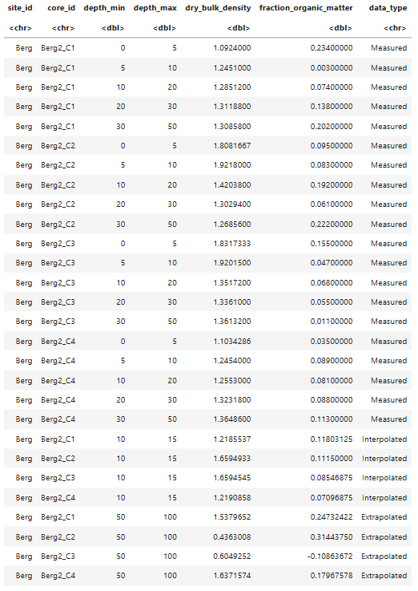

# Carbon stocks modelling helper functions

To interpolate and extrapolate we use function in an R script [stocks_helper_functions.R](stocks_helper_functions.R) is a script file containing three simple functions:

1. `interpolate_slice`

1. `predict_val`

#### The functions are written for implementation within a tidyverse pipe workflow.

### Example: interpolations of dry bulk density:

We start by loading the required libraries. For our purposes, we will use my favourite, the tidyverse - a collection of R packages. We will also load our helper functions using the source() function, which simply reads the specified file and loads all its functions and variables into memory. Note that the helper functions and the script file containing the code must be in the same directory for this to work.


```
library(tidyverse)
source("stocks_helper_functions.R")

```

For data were going to used sampled data from upper Berg River Estuary from one site with four cores using the tibble package in tidyverse.

```

Berg_sample_data <- tibble::tribble(
                      ~site_id,   ~core_id, ~depth_min, ~depth_max, ~dry_bulk_density, ~fraction_organic_matter,
                        "Berg", "Berg2_C1",          0,          5,            1.0924,                    0.234,
                        "Berg", "Berg2_C1",          5,         10,            1.2451,                    0.003,
                        "Berg", "Berg2_C1",         10,         20,           1.28512,                    0.074,
                        "Berg", "Berg2_C1",         20,         30,           1.31188,                    0.138,
                        "Berg", "Berg2_C1",         30,         50,           1.30858,                    0.202,
                        "Berg", "Berg2_C2",          0,          5,  1.80816666666667,                    0.095,
                        "Berg", "Berg2_C2",          5,         10,            1.9218,                    0.083,
                        "Berg", "Berg2_C2",         10,         20,           1.42038,                    0.192,
                        "Berg", "Berg2_C2",         20,         30,           1.30294,                    0.061,
                        "Berg", "Berg2_C2",         30,         50,           1.26856,                    0.222,
                        "Berg", "Berg2_C3",          0,          5,  1.83173333333333,                    0.155,
                        "Berg", "Berg2_C3",          5,         10,           1.92015,                    0.047,
                        "Berg", "Berg2_C3",         10,         20,           1.35172,                    0.068,
                        "Berg", "Berg2_C3",         20,         30,            1.3361,                    0.055,
                        "Berg", "Berg2_C3",         30,         50,           1.36132,                    0.011,
                        "Berg", "Berg2_C4",          0,          5,  1.10342857142857,                    0.035,
                        "Berg", "Berg2_C4",          5,         10,            1.2454,                    0.089,
                        "Berg", "Berg2_C4",         10,         20,            1.2553,                    0.081,
                        "Berg", "Berg2_C4",         20,         30,           1.32318,                    0.088,
                        "Berg", "Berg2_C4",         30,         50,           1.36486,                    0.113
  )

```

This will load `Berg_sample_data` into the environment. To view the data, we can use `View(Berg_sample_data)` or simply type the variable name and press Enter.
To see the column names, we use `colnames(Berg_sample_data)`.

To interpolate the `dry_bulk_density` and `fraction_organic_matter` will call our help functions

```
Berg_sample_data |>
dplyr::group_by(site_id, core_id) |>
dplyr::summarise(dry_bulk_density = interpolate_slice(pick(depth_max, dry_bulk_density), 15),
                fraction_organic_matter = interpolate_slice(pick(depth_max, fraction_organic_matter), 15), 
                depth_min = max(depth_min[depth_min <= 15], na.rm = TRUE), 
                depth_max = depth) |>
dplyr::ungroup() |>
dplyr::select(site_id, core_id, depth_min, depth_max, dry_bulk_density, fraction_organic_matter)

```

Let's carefully break down this R code step by step. 

### Grouping

```r
dplyr::group_by(site_id, core_id) |>
```

* Groups the data by `site_id` and `core_id`. this ensures that our interpolation will be at the core level
--

###  Summarising

```
Interpolated15cm <- dplyr::summarise(
		    dry_bulk_density = interpolate_slice(pick(depth_max, dry_bulk_density), 15),
		    fraction_organic_matter = interpolate_slice(pick(depth_max, fraction_organic_matter), 15), 
		    depth_min = max(depth_min[depth_min <= 15], na.rm = TRUE),
		    depth_max = 15)
      
```

This is where we use our custom `interpolate_slice` helper function, which takes two arguments: `data` and `depth`. For the `data` argument, we use the `pick()` function to create a dataframe with two columns: `depth_max` and `dry_bulk_density`. We then pass in the `depth` at which we want to perform the interpolation. Additionally, we also have to extract depth_min closest to our interpolation using the custom helper function ``get_nearest``. This code willcreate a data.frame for just the interpolated depth for the four cores but should have the same columns original dataframe.

We can use this data to visualise the interpolation, and it doesn’t look too bad. There are better approaches, of course, but most require more data. Here, we assume that our variables of interest change linearly, and our points (green) fall very close to where we would expect.  


## Extrapolation

Also important to note that the above code will estimate values for depths within the range of measured values, for value outside the range we use a similar but different function forextrapolation `predict_val`


```
Extropolated100cm <- Berg_sample_data |>
                     dplyr::group_by(site_id, core_id) |>
                     dplyr::summarise(dry_bulk_density = predict_val(pick(depth_max, dry_bulk_density), 100),
                                    fraction_organic_matter = predict_val(pick(depth_max, fraction_organic_matter), 100), 
                                    depth_min = max(depth_min[depth_min <= 100], na.rm = TRUE),
                                    depth_max = 100) |>
                     dplyr::ungroup() |>
                     dplyr::select(site_id, core_id, depth_min, depth_max, dry_bulk_density, fraction_organic_matter)

```
We can add the extrapoled data to our graph and we can see that extrapolation (green points)  tends to over/understimates values.


We can then combine the original dataset but first we can add another column to differentiate between interpolated and extrapolated.

```
Berg_sample_data$data_type <- "Measured"
Interpolated15cm$data_type <- "Interpolated"
Extropolated100cm$data_type <- "Extrapolated"

```

```
rbind(Berg_sample_data, Interpolated15cm, Extropolated100cm)

```

